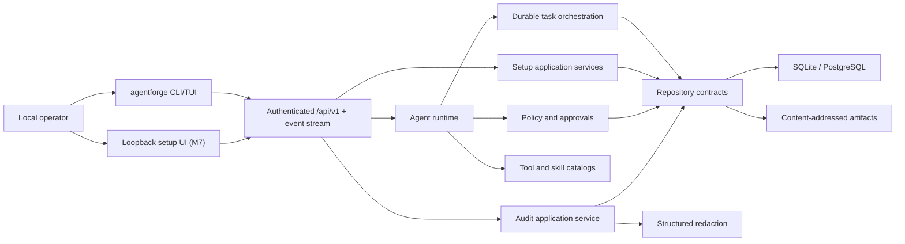
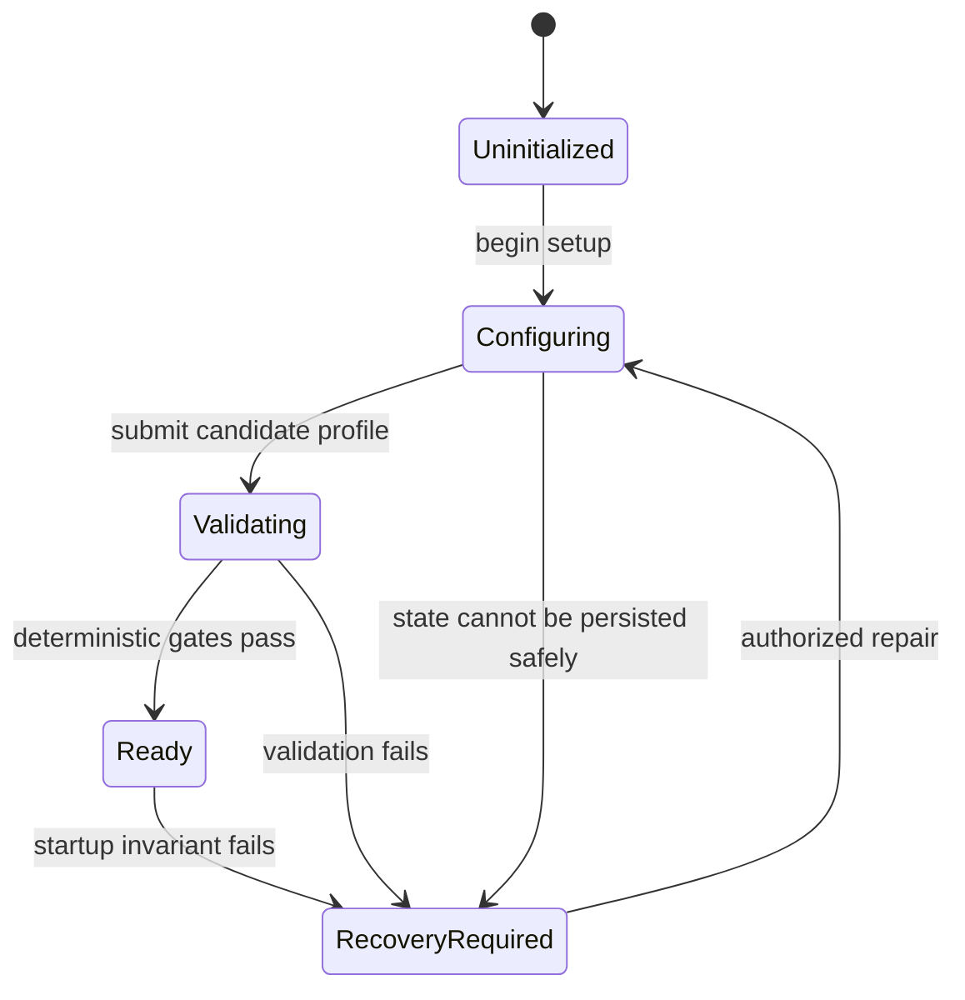

# AgentForge Architecture

## Product shape

AgentForge starts as a local-first modular monolith. One ASP.NET Core host composes
feature modules, background workers, health, and the control plane. A separate CLI
uses the control plane and may compose setup/recovery services in-process when the
normal host is unavailable.

## Dependency rule

`Domain` depends only on the BCL. `Abstractions` depends on Domain. Feature modules
depend on Domain and Abstractions, not other concrete feature modules. Host and CLI
are composition roots. Cross-feature work is coordinated through application
contracts and durable events, not direct implementation references.

## Startup and setup flow

In M0, absence of state means `Uninitialized`; unreadable state means
`RecoveryRequired`. Liveness remains healthy, readiness is unhealthy, and runtime
endpoints return a typed 503 until `Ready`. M1 moves state transitions into a
transactional setup service and emits audit/outbox records in the same transaction.

The first M1 command now performs `Uninitialized → Configuring` through
`ISetupApplicationService`. Interactive prompts and explicit headless options are
input adapters only; the same validation, transition, redaction, repository, audit,
and unit-of-work path handles both. Provider and agent validation remain closed, so
this command cannot reach `Ready`.

## Stable seams

- Provider, model, tool, skill, scheduler, channel, device, artifact, secret, audit,
  and persistence implementations stay behind AgentForge-owned interfaces.
- Framework and vendor SDK types never cross Domain or public control-plane contracts.
- Every run pins hashes/versions of policy, provider routing, environment, tools,
  skills, and artifacts.
- External content is evidence. It is never interpreted as policy or system-level instruction.

## Durability strategy

SQLite with WAL is the zero-dependency store. Aggregate version columns provide
optimistic concurrency; leases guard work ownership; unique idempotency constraints
and inbox/outbox tables prevent duplicate external effects. Large immutable data is
content-addressed outside relational rows. PostgreSQL later implements identical
repository contracts.

Audit callers submit typed metadata plus raw structured payloads to the Audit module.
The Security module canonicalizes and redacts those payloads before the Persistence
journal can receive them. Hash fields are length-prefixed before SHA-256 processing,
and a separate verifier streams the global chain to identify the first broken event.

## Framework spike decision

Microsoft Agent Framework is optional adapter material, not the orchestration source
of truth. The pinned spike verifies typed handlers, streamed workflow events, and
cancellation-token propagation. AgentForge retains tasks, leases, retries,
compensation, audit, approvals, snapshots, and promotion because those invariants
span more than a framework workflow execution.
