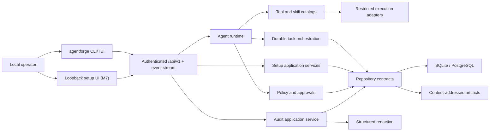
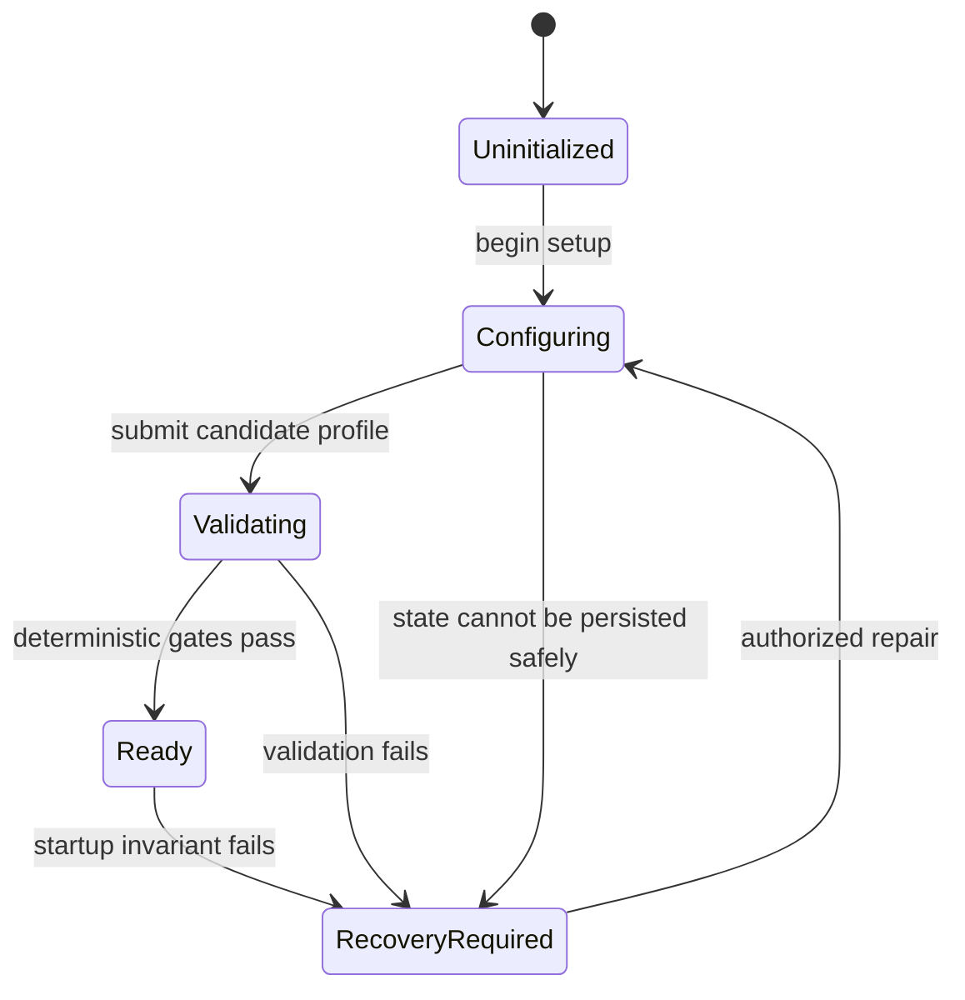

# AgentForge Architecture

## Product shape

AgentForge starts as a local-first modular monolith. One ASP.NET Core host composes
feature modules, background workers, health, and the control plane. A separate CLI
uses the control plane and may compose setup/recovery services in-process when the
normal host is unavailable.

## Dependency rule

`Domain` depends only on the BCL. `Abstractions` depends on Domain. Feature modules
depend on Domain and Abstractions, not other concrete feature modules. Host and CLI
are composition roots. Cross-feature work is coordinated through application
contracts and durable events, not direct implementation references.

## Startup and setup flow

In M0, absence of state means `Uninitialized`; unreadable state means
`RecoveryRequired`. Liveness remains healthy, readiness is unhealthy, and runtime
endpoints return a typed 503 until `Ready`. M1 moves state transitions into a
transactional setup service and emits audit/outbox records in the same transaction.

The first M1 command now performs `Uninitialized → Configuring` through
`ISetupApplicationService`. Interactive prompts and explicit headless options are
input adapters only; the same validation, transition, redaction, repository, audit,
and unit-of-work path handles both. Provider and agent validation remain closed, so
this command cannot reach `Ready`.

Provider setup persists endpoint/model metadata and observed deterministic capability
evidence, but credential material is represented only by `SecretReference`. Windows
uses current-user DPAPI-protected files; Linux invokes the known `secret-tool` binary
with argument arrays, bounded streams, an environment allowlist, timeout, and
process-tree cleanup. Validators materialize a `SecretLease` for one call and clear its
character buffer on disposal. An unavailable OS facility is a typed failure, never a
plaintext fallback.

Agent identity is a versioned aggregate separate from provider identity. Its model
policy points to a provider profile without copying credential material or making the
provider part of the agent's identity. The setup evaluator normalizes the candidate,
checks provider evidence and locality, then renders explicit `Allow`, `Deny`, or
`RequireApproval` decisions. Unknown or not-yet-configured authority is absent and
therefore denied. Preview performs no writes; create repeats evaluation and commits
the exact bounded definition with one redacted audit event.

The headless CLI composes the same setup service for agent preview/create. Its secure
defaults are local-only routing, denied network access, no tool/skill grants, bounded
budgets, no children unless all child bounds are supplied, and `Propose` learning
with proposal-workspace-only mutation. These records are policy inputs; M2 adds the
general per-invocation authorization evaluator and approval binding.

Setup completion is the only application path to `Ready`. It verifies the current
audit chain, a same-installation named agent, an observed text provider, and live
materialization of each usable provider reference. It then creates a 256-bit random
administrator credential, stores the client value in the selected OS secret store,
and persists only its reference plus PBKDF2-SHA256 verifier. The two pure state
transitions and administrator/audit rows commit atomically; failed commits delete the
new external credential. Ready runtime requests require fixed-time administrator
authentication.

## Stable seams

- Provider, model, tool, skill, scheduler, channel, device, artifact, secret, audit,
  and persistence implementations stay behind AgentForge-owned interfaces.
- Framework and vendor SDK types never cross Domain or public control-plane contracts.
- Every run pins hashes/versions of policy, provider routing, environment, tools,
  skills, and artifacts.
- External content is evidence. It is never interpreted as policy or system-level instruction.

## Restricted execution boundary

`AgentForge.Tools` implements `ISandbox` without referencing another feature
implementation. Its restricted-host adapter starts only a fully qualified, existing,
non-link executable with `ProcessStartInfo.ArgumentList`, clears the child environment,
contains the working directory, and bounds output, time, cancellation, and tree cleanup.
Capability flags describe only controls the selected OS adapter enforces. Unsupported
container, network, filesystem, or resource isolation fails typed.

The kernel is deliberately not an authorization service and has no invocation endpoint.
The later tool application service must build an authorization context from its immutable
descriptor, re-read current agent policy, atomically consume exact approval evidence and
append audit/outbox state, then call `ISandbox`. Inventory paths or model-supplied tool
identity can never cross that boundary directly.

## Durability strategy

SQLite with WAL is the zero-dependency store. Aggregate version columns provide
optimistic concurrency; leases guard work ownership; unique idempotency constraints
and inbox/outbox tables prevent duplicate external effects. Large immutable data is
content-addressed outside relational rows. PostgreSQL later implements identical
repository contracts.

Audit callers submit typed metadata plus raw structured payloads to the Audit module.
The Security module canonicalizes and redacts those payloads before the Persistence
journal can receive them. Hash fields are length-prefixed before SHA-256 processing,
and a separate verifier streams the global chain to identify the first broken event.

## Framework spike decision

Microsoft Agent Framework is optional adapter material, not the orchestration source
of truth. The pinned spike verifies typed handlers, streamed workflow events, and
cancellation-token propagation. AgentForge retains tasks, leases, retries,
compensation, audit, approvals, snapshots, and promotion because those invariants
span more than a framework workflow execution.
