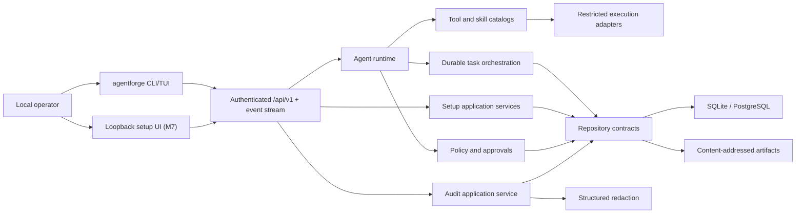
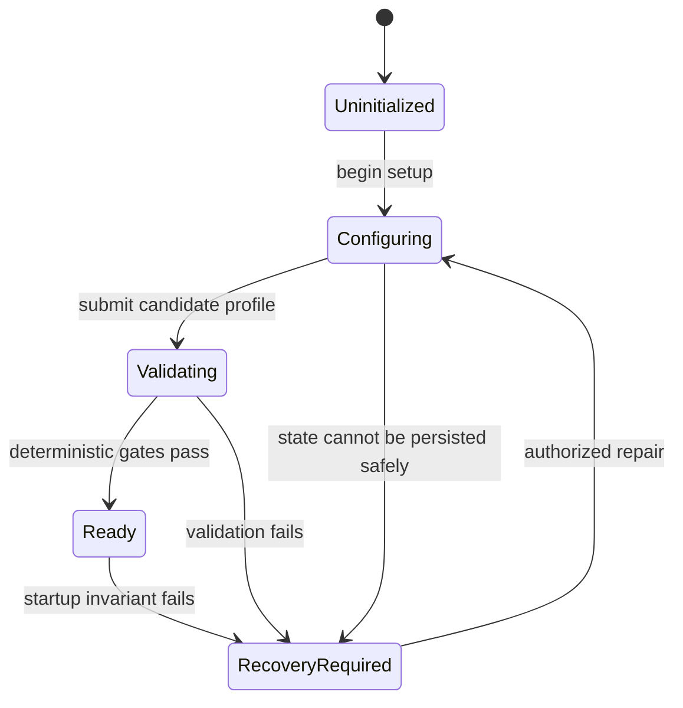

# AgentForge Architecture

## Product shape

AgentForge starts as a local-first modular monolith. One ASP.NET Core host composes
feature modules, background workers, health, and the control plane. A separate CLI
uses the control plane and may compose setup/recovery services in-process when the
normal host is unavailable.

## Dependency rule

`Domain` depends only on the BCL. `Abstractions` depends on Domain. Feature modules
depend on Domain and Abstractions, not other concrete feature modules. Host and CLI
are composition roots. Cross-feature work is coordinated through application
contracts and durable events, not direct implementation references.

## Startup and setup flow

In M0, absence of state means `Uninitialized`; unreadable state means
`RecoveryRequired`. Liveness remains healthy, readiness is unhealthy, and runtime
endpoints return a typed 503 until `Ready`. M1 moves state transitions into a
transactional setup service and emits audit/outbox records in the same transaction.

The first M1 command now performs `Uninitialized → Configuring` through
`ISetupApplicationService`. Interactive prompts and explicit headless options are
input adapters only; the same validation, transition, redaction, repository, audit,
and unit-of-work path handles both. Provider and agent validation remain closed, so
this command cannot reach `Ready`.

Provider setup persists endpoint/model metadata and observed deterministic capability
evidence, but credential material is represented only by `SecretReference`. Windows
uses current-user DPAPI-protected files; Linux invokes the known `secret-tool` binary
with argument arrays, bounded streams, an environment allowlist, timeout, and
process-tree cleanup. Validators materialize a `SecretLease` for one call and clear its
character buffer on disposal. An unavailable OS facility is a typed failure, never a
plaintext fallback.

Agent identity is a versioned aggregate separate from provider identity. Its model
policy points to a provider profile without copying credential material or making the
provider part of the agent's identity. The setup evaluator normalizes the candidate,
checks provider evidence and locality, then renders explicit `Allow`, `Deny`, or
`RequireApproval` decisions. Unknown or not-yet-configured authority is absent and
therefore denied. Preview performs no writes; create repeats evaluation and commits
the exact bounded definition with one redacted audit event.

The headless CLI composes the same setup service for agent preview/create. Its secure
defaults are local-only routing, denied network access, no tool/skill grants, bounded
budgets, no children unless all child bounds are supplied, and `Propose` learning
with proposal-workspace-only mutation. These records are policy inputs; M2 adds the
general per-invocation authorization evaluator and approval binding.

Setup completion is the only application path to `Ready`. It verifies the current
audit chain, a same-installation named agent, an observed text provider, and live
materialization of each usable provider reference. It then creates a 256-bit random
administrator credential, stores the client value in the selected OS secret store,
and persists only its reference plus PBKDF2-SHA256 verifier. The two pure state
transitions and administrator/audit rows commit atomically; failed commits delete the
new external credential. Ready runtime requests require fixed-time administrator
authentication.

## Stable seams

- Provider, model, tool, skill, scheduler, channel, device, artifact, secret, audit,
  and persistence implementations stay behind AgentForge-owned interfaces.
- Framework and vendor SDK types never cross Domain or public control-plane contracts.
- Every run pins hashes/versions of policy, provider routing, environment, tools,
  skills, and artifacts.
- External content is evidence. It is never interpreted as policy or system-level instruction.

## Restricted execution boundary

`AgentForge.Tools` implements `ISandbox` without referencing another feature
implementation. Its restricted-host adapter starts only a fully qualified, existing,
non-link executable with `ProcessStartInfo.ArgumentList`, clears the child environment,
contains the working directory, and bounds output, time, cancellation, and tree cleanup.
Capability flags describe only controls the selected OS adapter enforces. Unsupported
container, network, filesystem, or resource isolation fails typed.

The kernel is deliberately not an authorization service and has no invocation endpoint.
The tool application service builds an authorization context from its immutable
descriptor, re-reads current agent policy, atomically consumes exact approval evidence and
appends audit state, then calls `ISandbox`. Inventory paths or model-supplied tool identity
can never cross that boundary directly.

## Authoritative tool catalog

`AgentForge.Tools` also implements `IToolCatalog` as an immutable map keyed by exact
`(tool ID, version)`. A descriptor owns the callable executable path, typed parameter-to-
argument bindings, capability and risk, target mapping, side effects, provenance,
sandbox/network requirements, and time/output bounds. Admission validates and snapshots
the complete definition before producing its canonical descriptor hash.

Discovery is deliberately progressive. Search returns `ToolSummary` records without
process paths, fixed arguments, bindings, or environment names. Full description requires
an exact normalized ID and SemVer 2 version and never selects a nearby or latest version.
Neither operation checks executable availability or starts a process. The later invocation
service accepts values for the descriptor's parameters, not caller-authored executable,
risk, capability, or isolation fields, and pins the descriptor hash into authorization,
audit, and run evidence.

## Policy-bound tool invocation

`IToolInvocationService` is the only application contract permitted to connect a catalog
descriptor to `ISandbox`. Its request contains exact catalog identity, typed parameter
values, current installation/agent versions, workspace, correlation, and idempotency. It
derives every capability and process field from the descriptor, canonicalizes the values,
builds authorization identity including the descriptor hash, intersects current agent
network policy, and evaluates policy plus exact approval.

The first EF unit of work consumes a single-use grant, inserts an `Authorized` invocation,
and appends authorization audit. The sandbox is called only after that commit and a second
policy/version read. A second unit of work persists terminal state and completion audit.
Durable rows retain output SHA-256/length evidence, not raw bytes. An exact terminal retry
returns recorded status without execution; an uncertain `Authorized` row or changed input
under the same idempotency key fails closed.

The service has no control-plane or CLI mutation surface in this slice. Production
composition has an empty catalog, and unavailable network/container isolation remains a
typed `UnsupportedCapability` instead of falling back to restricted host.

## Safe availability probes

Availability is an explicit descriptor operation, never a side effect of inventory,
search, catalog admission, or exact description. `AvailabilityProbe` admission requires
the exact `tool:availability.probe` inventory capability, no target, parameters, side
effects, inherited environment, or network, and a fixed/literal version or help argument.
It caps execution at 30 seconds and 64 KiB and requires a sandbox reporting network
isolation.

`IToolAvailabilityProbeService` delegates the empty typed invocation to the same immutable
descriptor, current policy, exact approval, durable idempotency, audit, and `ISandbox`
boundary. A successful immediate result may expose only the first nonempty printable
strict-UTF-8 line, after full-line credential redaction, capped at 512 characters. Invalid
encoding, sensitive output, and durable replay expose no observed text. Production still
has no public probe route and composes an empty catalog.

## Durability strategy

SQLite with WAL is the zero-dependency store. Aggregate version columns provide
optimistic concurrency; leases guard work ownership; unique idempotency constraints
and inbox/outbox tables prevent duplicate external effects. Large immutable data is
content-addressed outside relational rows. PostgreSQL later implements identical
repository contracts.

## Provider-neutral model boundary

`AgentForge.Domain.Models` owns typed messages, artifact-backed attachments, response
formats, tool definitions/results, capability evidence, budgets, usage/cost, provider
errors, and sequenced stream events. `AgentForge.Abstractions.Models` exposes only
`IModelProvider` and the exact-profile `IModelProviderCatalog`. Domain has no SDK/package
dependency, and vendor records cannot cross this boundary.

`AgentForge.Models` validates and snapshots requests before asynchronous enumeration.
JSON schemas, tool results, tool arguments, and structured output are bounded, parsed with
fixed depth, reject duplicate object keys, and normalize before use. Attachment content is
an immutable artifact hash/media type/length/modality reference; the input fingerprint
includes that reference so an image or document cannot be silently omitted without
changing evidence. Capability evidence records source, availability, observation time, and
optional expiry; any unavailable, unknown, temporarily failing, future, or expired evidence
fails closed for that capability. The started event pins separate normalized input and
sorted capability-evidence SHA-256 values.

The deterministic provider owns immutable scripts and emits started, text delta, tool-call
delta/completion, structured output, usage, typed error, and completion events with strict
sequence numbers. It intersects the request with provider evidence and token/tool/event/
time limits, honors cancellation, and never emits completion after a scripted failure.

The credential-free OpenAI-compatible adapter translates normalized requests to an exact
chat-completions endpoint. HTTPS is required unless its composition explicitly opts into
plaintext HTTP for a local/LAN endpoint. Endpoint credentials, query/fragment data,
redirects, caller-owned HTTP headers/credentials, cookies/proxies, and declared media
capabilities are refused. Production construction owns a fixed no-cookie, no-proxy,
no-redirect transport; only the unit-test assembly can inject a fake message handler.
The adapter bounds serialized requests, total response bytes, individual SSE lines/events,
strict UTF-8, JSON depth/duplicates, tool argument accumulation, event count, output usage,
and wall time. Structured output is accumulated and validated before one atomic event;
provider error bodies never become application messages. Tool results preserve their error
bit in a normalized JSON envelope and returned tool calls must match an exact request tool.

Production DI still contains an empty immutable provider catalog and no invocation route.
The compatible adapter has no credential mode and is composed only by tests or an explicit
live gate. Hosted adapters may use vendor SDKs or `Microsoft.Extensions.AI` only inside the
feature boundary and must add model-context redaction, invocation-scoped secret
materialization, locality/policy routing, audit, and durable run snapshots before exposure.

Audit callers submit typed metadata plus raw structured payloads to the Audit module.
The Security module canonicalizes and redacts those payloads before the Persistence
journal can receive them. Hash fields are length-prefixed before SHA-256 processing,
and a separate verifier streams the global chain to identify the first broken event.

## Framework spike decision

Microsoft Agent Framework is optional adapter material, not the orchestration source
of truth. The pinned spike verifies typed handlers, streamed workflow events, and
cancellation-token propagation. AgentForge retains tasks, leases, retries,
compensation, audit, approvals, snapshots, and promotion because those invariants
span more than a framework workflow execution.
